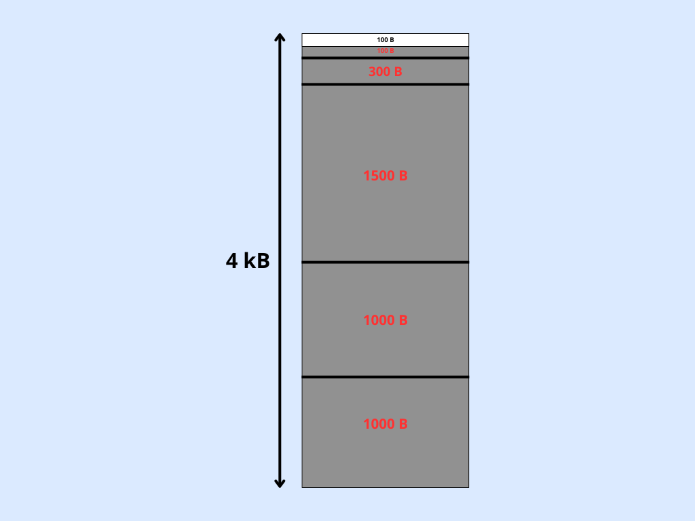
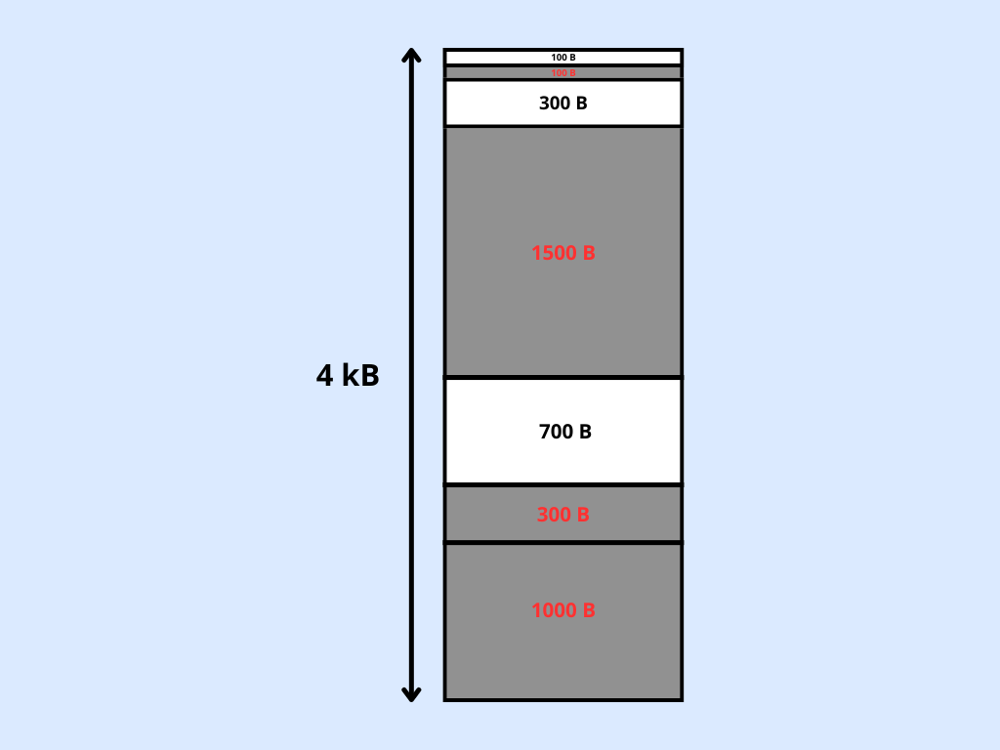

# Memory Management - Demo Application

_Go back to the [demos page](../demos.md)_

_Go back to the [main page](../../README.md)_

This section provides the implementations of some **Heap Allocation Algorithms**
and a __simple analysis__ of their behaviour by means of an easy **demo application**.

- [FreeRTOS Options for Dynamic Memory Allocation](#freertos-options-for-dynamic-memory-allocation)
- [Revised Implementation of heap_4.c](#revised-implementation-of-heap_4c)
- [Testing Demo Application ](#testing-demo-application)
- [Evaluation](#evaluation)
    - [Best-Fit](#best-fit)
    - [Worst-Fit](#worst-fit)
    - [First-Fit](#first-fit)

## FreeRTOS Options for Dynamic Memory Allocation

Particularly, FreeRTOS comes with five example implementations of both pvPortMalloc() and vPortFree():
- heap_1.c
- heap_2.c
- heap_3.c
- heap_4.c
- heap_5.c
all located in the  `FreeRTOS/Source/portable/MemMang` directory.

## Revised Implementation of heap_4.c

In this project, a revised version of `heap_4.c` called `heap_4_revised.c` was implemented and inserted in the `./MemMang/` project directory.
**N.B.**: before building the project, modify the makefile updating the path for the Memory Management ensuring that the proper file is selected. 

The standard `heap_4.c` uses by default the **first-fit** algorithm.
We added the implementation of **best-fit** and **worst-fit** algorithms.
The Allocation Type can be changed in the `FreeRTOSConfig.h` file
 * by setting the value of `configHEAP_ALLOCATION_TYPE` to:
 * 1 -> **Best-Fit**
 * 2 -> **Worst-Fit**
 * __any else__ -> **First-Fit**

## Testing Demo Application 
You can evaluate the behavior of the **various allocation algorithms** by running the `main_memManagement.c` test application three times, each time modifying the value of `configHEAP_ALLOCATION_TYPE` in the `FreeRTOSConfig.h` file.

The `main_memManagement.c` demo application can be selected by setting the `mainCREATE_SIMPLE_DEMO` value to `7`.

The `main` just:
1. **allocates** `1000 bytes`
2. **allocates** `1000 bytes`
3. **allocates** `1500 bytes`
4. **allocates** `100 bytes`
5. **allocates** `100 bytes`
6. **allocates** `100 bytes`
7. **allocates** `100 bytes`
8. **deallocates** `1000 bytes` (__second block__)
9. **deallocates** `100 bytes` (__fourth block__)
10. **deallocates** `100 bytes` (__fifth block__)
11. **deallocates** `100 bytes` (__sixth block__)
12. **allocates** `300 bytes`
13. **allocates** `1000 bytes`
14. **creates** a `task` (__TASK 1__)

After each operation, the **free heap space** and the **minimum ever free heap space**
When a block cannot be allocated, the system will print an error message
defined in the `vApplicationMallocFailedHook` function in `main.c`.

## Evaluation
Now let's dive in the evaluation of the allocation algorithms considering the above mentioned testing demo application output.
**N.B.**: During the testing, the `configTOTAL_HEAP_SIZE` value in the `FreeRTOSConfig.h` file was set to 4 kB configuring the
total size (in bytes) of the array.

### Best-Fit
When **Best-Fit** is selected, the main blocks when trying to create the task (__the malloc fails because there is not enough space__). The obtained output is:

| **Message**                                       | **Free Heap (bytes)** | **Minimum Ever Free Heap (bytes)** |
|--------------------------------------------------|-----------------------|------------------------------------|
| 1. *Before allocating memory blocks*                | 0                     | 0                                  |
| 2. *After allocated 1000 bytes*                     | 3072                  | 3072                               |
| 3. *After allocated 1000 bytes*                     | 2064                  | 2064                               |
| 4. *After allocated 1500 bytes*                     | 552                   | 552                                |
| 5. *After allocated 100 bytes*                      | 440                   | 440                                |
| 6. *After allocated 100 bytes*                      | 328                   | 328                                |
| 7. *After allocated 100 bytes*                      | 216                   | 216                                |
| 8. *After allocated 100 bytes*                      | 104                   | 104                                |
| 9. *After deallocated the second block (1000 bytes)* | 1112                  | 104                                |
| 10. *After deallocated the fourth block (100 bytes)*  | 1224                  | 104                                |
| 11. *After deallocated the fifth block (100 bytes)*   | 1336                  | 104                                |
| 12. *After deallocated the sixth block (100 bytes)*   | 1448                  | 104                                |
| 13. *After allocated 300 bytes*                      | 1136                  | 104                                |
| 14. *After allocated 1000 bytes*                     | 128                   | 104                                |
|                                                  |                       |                                    |
| **Ooops...Malloc failed**                        |                       |                                    |

The **heap configuration** at __step 14__ (**before the failure**) is the following:

It's clear that there is not sufficient space for allocating memory for the **TCB**.

### Worst-Fit
When **Worst-Fit** is selected, the main blocks before allocating the last block (__1000 Bytes__). The obtained output is:

| **Message**                                       | **Free Heap (bytes)** | **Minimum Ever Free Heap (bytes)** |
|---------------------------------------------------|-----------------------|------------------------------------|
| 1. Before allocating memory blocks                   | 0                     | 0                                  |
| 2. After allocated 1000 bytes                        | 3072                  | 3072                               |
| 3. After allocated 1000 bytes                        | 2064                  | 2064                               |
| 4. After allocated 1500 bytes                        | 552                   | 552                                |
| 5. After allocated 100 bytes                         | 440                   | 440                                |
| 6. After allocated 100 bytes                         | 328                   | 328                                |
| 7. After allocated 100 bytes                         | 216                   | 216                                |
| 8. After allocated 100 bytes                         | 104                   | 104                                |
| 9. After deallocated the second block (1000 bytes)   | 1112                  | 104                                |
| 10. After deallocated the fourth block (100 bytes)    | 1224                  | 104                                |
| 11. After deallocated the fifth block (100 bytes)     | 1336                  | 104                                |
| 12. After deallocated the sixth block (100 bytes)     | 1448                  | 104                                |
| 13. After allocated 300 bytes                         | 1136                  | 104                                |
| **Ooops...Malloc failed**                         |                       |                                    |

### First-Fit
When **First-Fit** is selected, the main blocks before allocating the last block (__1000 Bytes__). 

The output is the same obtained with [**Worst-Fit**](#worst-fit) algorithm 
(in this specific example the two algorithms behave in the same way).

In both cases, the **heap configuration** at __step 13__ (**before the failure**) is the following:

It's clear that there is not sufficient space for allocating memory for the last block of **1000 B**.