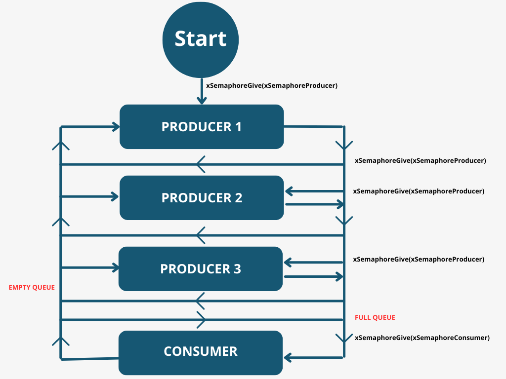
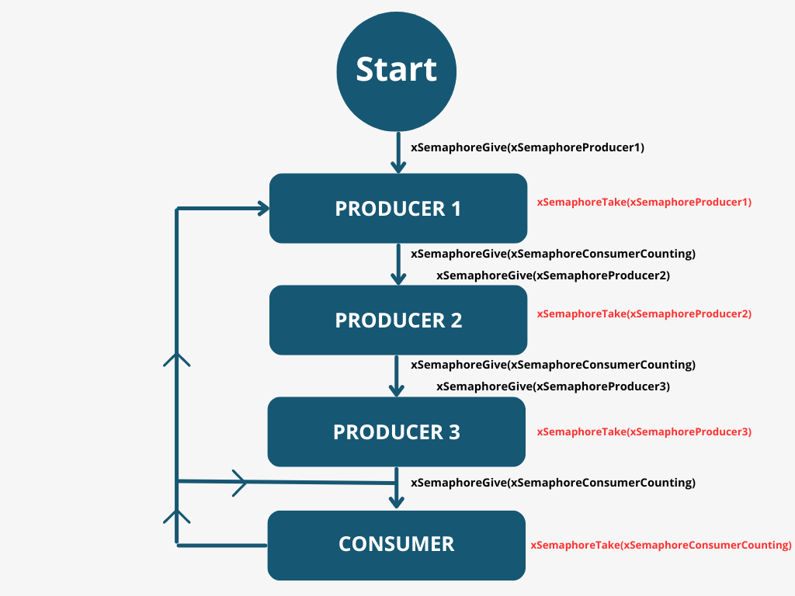

# Queues and Tasks' Synchronization - Demo Applications

_Go back to the [demos page](../demos.md)_

_Go back to the [main page](../../README.md)_

This section provides the description of some demo applications which depict the main FreeRTOS functionalities concerning **Queues** and **Tasks' Synchronization**. 
In each tutorial is possible to find detailed instructions for running each **DEMO application** in VSCode.  

- [Demo Applications Structure](#demo-applications-structure)
  - [Simple Queue Example](#simple-queue-example)
  - [Queue and Semaphores: Example 1](#queue-and-semaphores-example-1)
  - [Queue and Semaphores: Example 2](#queue-and-semaphores-example-2)

## Demo Applications Structure
Each DEMO application in this project is selected in the `main` by setting the `mainCREATE_SIMPLE_DEMO` value.
Considering **Queues and Tasks' Synchronization** we have that
- `mainCREATE_SIMPLE_DEMO = 4` selects the `main_queue.c` DEMO application, i.e, the simple example for queue usage.
- `mainCREATE_SIMPLE_DEMO = 5` selects the `main_semaphore.c` DEMO application, i.e, a first example with semaphores.
- `mainCREATE_SIMPLE_DEMO = 6` selects the `main_semaphore2.c` DEMO application, i.e., a second example with semaphores.

Now open `VSCode` for testing the demo applications. Select the demo to test by setting the `mainCREATE_SIMPLE_DEMO` variable to the proper value.
Then from the __Run and Debug__ section click on __Launch QEMU RTOSDemo__ to run the application attaching the debugger.

### Simple Queue Example
This demo application shows the main FreeRTOS API functions for **Queue Management**. **Queues** provide **Task-to-Task** communication mechanism.

The `main` creates __four__ tasks:
- three **PRODUCERS** which send items in the queue 
- one **CONSUMER** which reads from the queue 
The **CONSUMER** has the highest priority, the three producers have the same priority.

When the scheduler starts the **CONSUMER** task tries to read from the queue which is empty. The **CONSUMER** task will block for 100ms waiting for data to be available.
At this point one of the **PRODUCERS** will send data to the queue, unblocking the **CONSUMER** which will read the data from the queue. The **CONSUMER** task will then block again waiting for data and the cycle will continue. In this way the **PRODUCERS** and **CONSUMER** tasks are synchronized by the queue.

Sometimes if the 100 ms elapses while the queue is still empty, the **CONSUMER** task will print an __error message__.
Moreover, each task contains a **CRUDE DELAY** implementation for __demonstration purposes__.

### Queue and Semaphores: Example 1
This demo application shows the main FreeRTOS API functions for **Tasks' Synchronization** using **semaphores**. **Semaphores** are objects used to send interrupts for unblocking tasks. This results in tasks synchronization with interrupts.

The main creates the **queue**, the **semaphores** and **four tasks** with the **SAME** priority:
- three **PRODUCERS** which send items in the queue
- one **CONSUMER** which reads from the queue

Totally there are two **binary semaphores**:
- one for **PRODUCERS**
- one for the **CONSUMER**

At the beginning the main unblock the **producers**, calling `xSemaphoreGive(xSemaphoreProducer)` which start to fill the queue. When the queue is full, the **consumer** can start to read (the `xSemaphoreGive(xSemaphoreConsumer)` is called). When the **consumer** reads out all the values in the queue, it unblocks the **producers** and the process will be repeated again. 

It's clear that in this case the **priority** of the tasks is **not important**, because the semaphores are used to synchronize the tasks. __Any priority can be used__.

The general behaviour is depicted in the following diagram:

### Queue and Semaphores: Example 2
This demo application is a **more advanced example** which shows the usage of **semaphores** for **tasks synchronization**

The main creates the **queue**, the **semaphores** and **four tasks** with the **SAME** priority:
- three **PRODUCERS** which send items in the queue
- one **CONSUMER** which reads from the queue

Totally there are four **semaphores**:
- three **binary semaphores** for the three **producers**
- one **counting semaphore** for the **consumer**

Each **producer** inserts its value in the queue increasing the value of the counting semaphore of the **consumer** (the value of `xSemaphoreConsumerCounting` represents the number of items in the queue). Then it unblocks the next task as depicted in the following diagram.

Overall, each **producer** inserts its value and unblock the next task; then the **consumer** reads out all the values inserted in the queue by the **producers** before unblocking the **first producer** and so on...

Also here the **priority** does not change the behaviour of the tasks.
